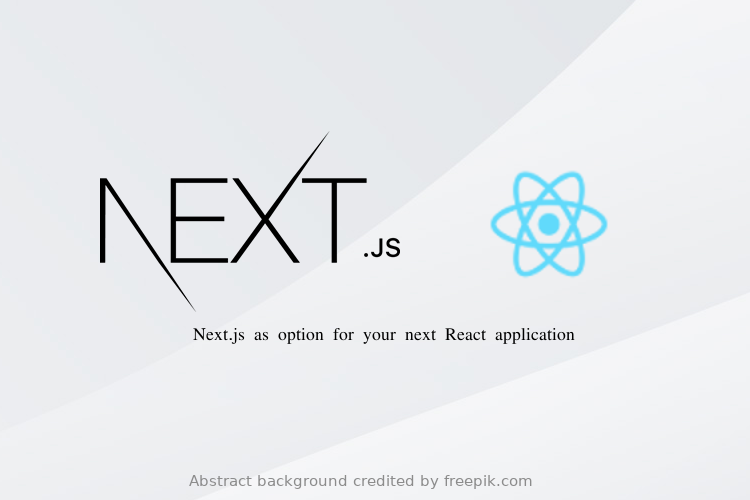

<h1 align="center">
  
</h1>

<p align="center">
  

  

  <a href="https://www.linkedin.com/in/lucasdeveloperti/">
    
  </a>

  <a href="https://github.com/lucas-eduardo/example-next/commits/master">
    
  </a>

  

   <a href="https://github.com/lucas-eduardo/example-next/stargazers">
    
  </a>
</p>

## 💻 Sobre

Exemplos de utilização do nextjs

---

### 🧭 Rodando a aplicação

```bash
# Clone este repositório
$ git clone https://github.com/lucas-eduardo/example-next

# Acesse a pasta do projeto no seu terminal/cmd
$ cd example-next

# Instale as dependências
$ npm install

# Execute a aplicação em modo de desenvolvimento
$ npm run start

# A aplicação será aberta na porta:3000 - acesse http://localhost:3000
```
